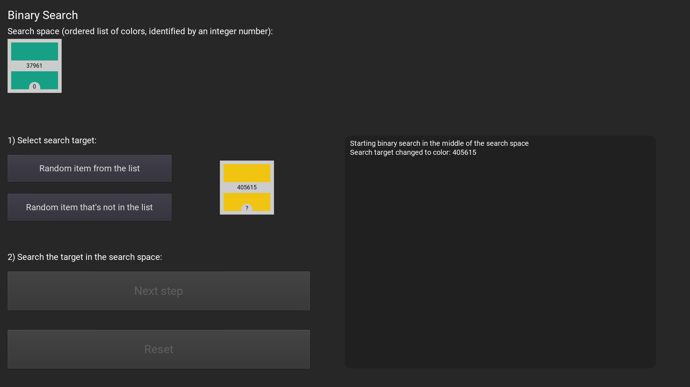

# interactive binary search

In this repo: A recursive and an iterative implementation of the binary search algorithm in GDScript as well as an interactive, step-by-step visualization of the algorithm.

Try it yourself: https://eddex.github.io/interactive-binary-search/

This project was created using [Godot 3.2.3](https://godotengine.org).